# Proyecto IDP NAGIOS

## Monitorizacion grafica del nagios desde una maquina servidora real a una maquina cliente real

Nos conectamos desde nuestra maquina cliente a la ip de la maquina servidora en este caso **10.1.1.154** para descargarnos el programa de version cliente para poder monitorizar desde nuestra maquina servidora al PC cliente

En primer lugar introducimos la ip "10.1.1.154" para poder acceder a Nagios.
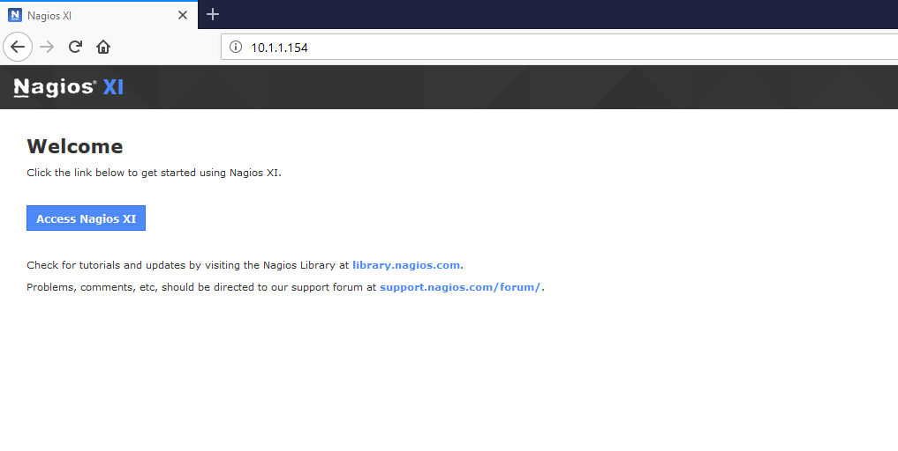

Ahora empezamos la intalación de nagios.
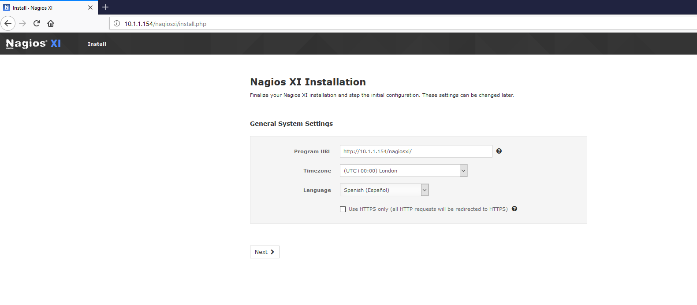

Introducimos los datos de nuestra cuenta (nombre de usuario, contraseña, email) y le damos a "finish install" (instalar).
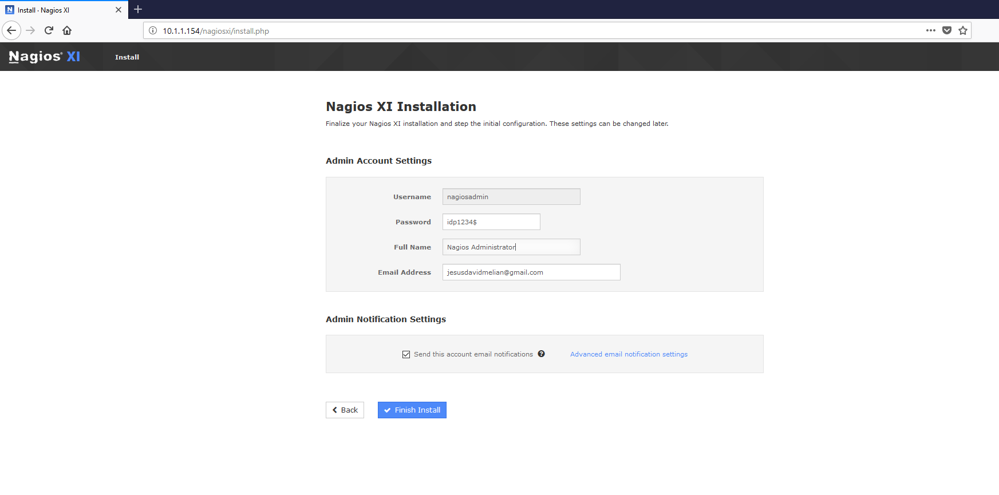

Esperamos a que finalice la instalacion.
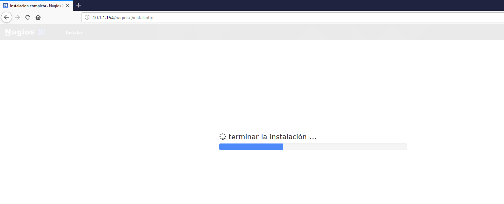

Una vez finalizada la instalación nos da las credenciales con las cuales deberemos acceder a nuestra cuenta. Acto seguido le damos a "iniciar sesión en nagios xi"
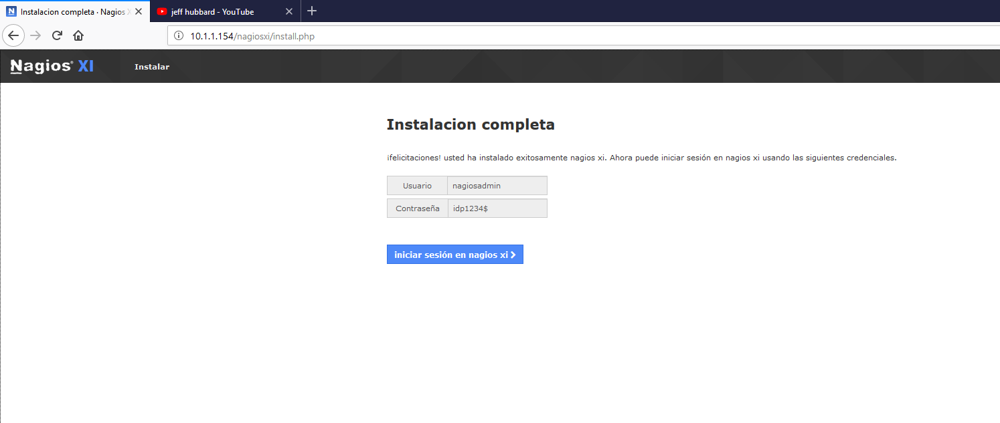

Ahora accedemos a nuestra cuenta con el usuario y la contraseña que nos facilitaron anteriormente. 
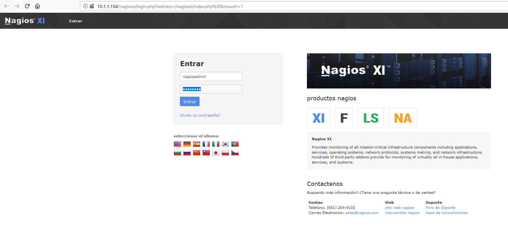

Ya estamos dentro de Nagios xi. 
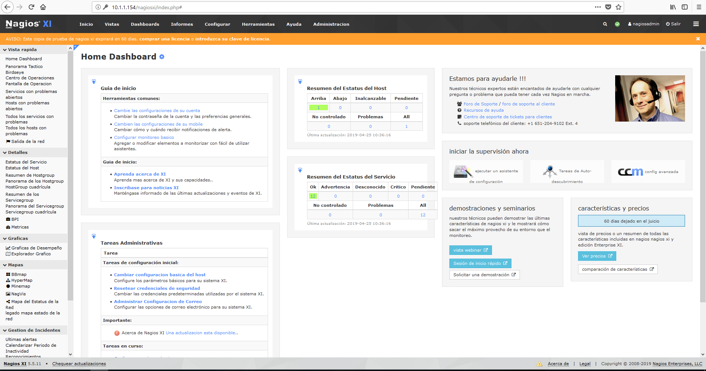

Ahora dentro de la página principal pinchamos en "ejecutar un asistente".
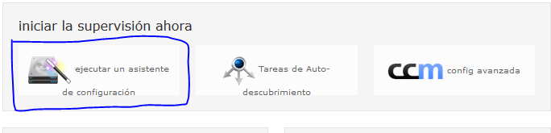

Ahora nos van a mostrar los diferentes asistentes que hay, nosotros como vamos a monitorizar un windows, tenemos que seleccionar la opción que pone "Windows Desktop".
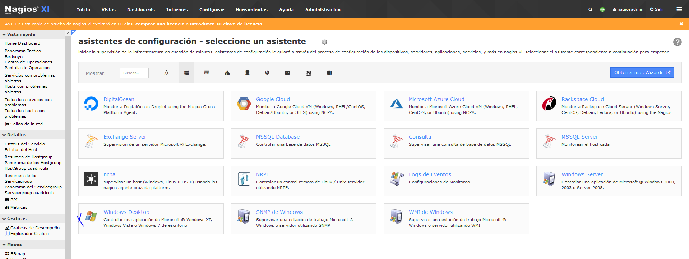

Buscamos la dirección ip del servidor al que nos vamos a conectar, y la introducimos en la casilla de "Dirección IP".
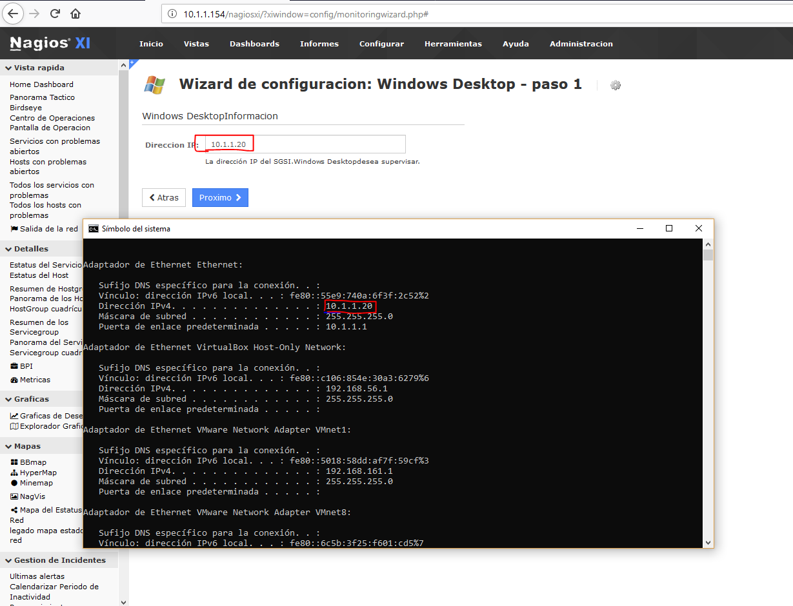

Una vez hayamos puesto la dirección ip, descargamos "64-Bit Agente", que es la opción de 64 bits.
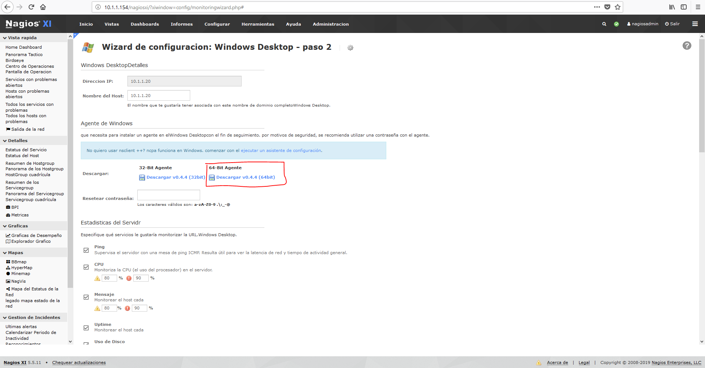

Ahora procedemos a instalarlo.
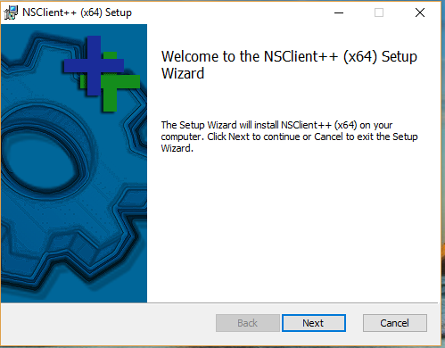

Luego ponemos la opción "Generic".
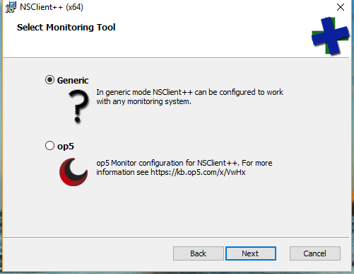

Ahora nos dice que elijamos el tipo de configuración. Nosotros vamos a elegir la opción "Typical".
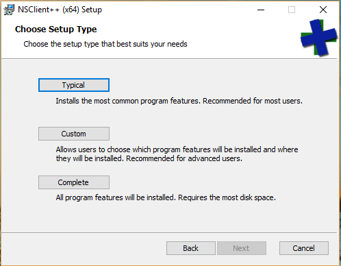

Le damos a "next" (siguiente).
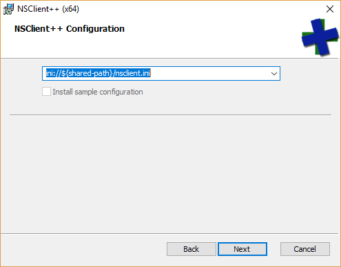

Acto seguido en la casilla de "Password", escribimos nuestra contraseña, que en este caso es "idp1234$".
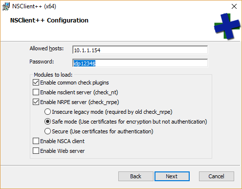

Ahora hacemos clic en "install" y empezará nuestra instalación.
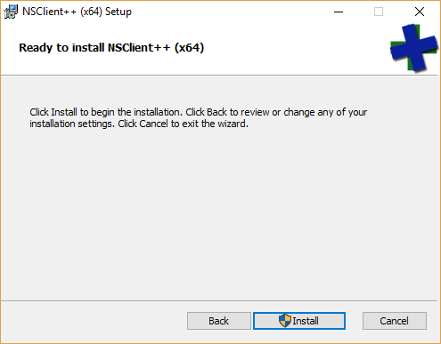

Una vez finalizada la instalación le damos a "finish" para completar la instalación de manera correcta.
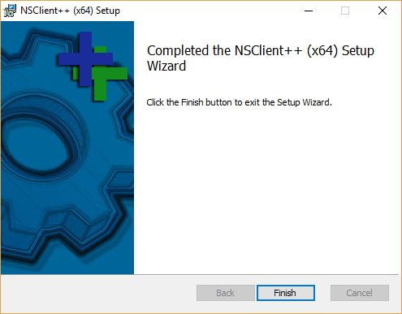

Ahora procedemos a monitorizar el equipo utilizando un programa de benchmarks (heaven benchmarks) para meterle rendimiento al PC Cliente y que nos salten los avisos que configuramos anteriormente

En la primera vemos que no ocurre nada ya que tienen que pasar unos segundos hasta la primera monitorizacion de los componentes del pc cliente 
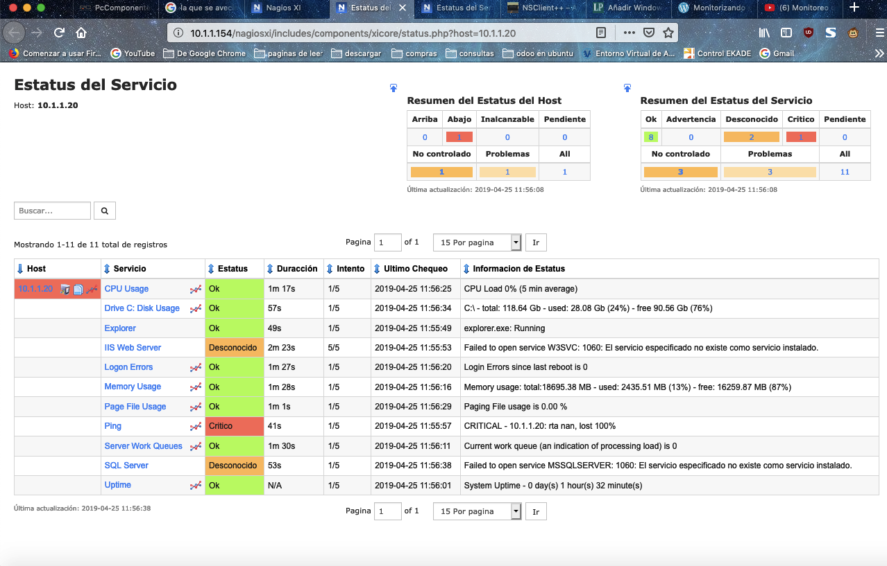

Aqui ya vemos como el uso de la CPU salta al 52% - Disco duro al 24% y el uso de la RAM al 22%
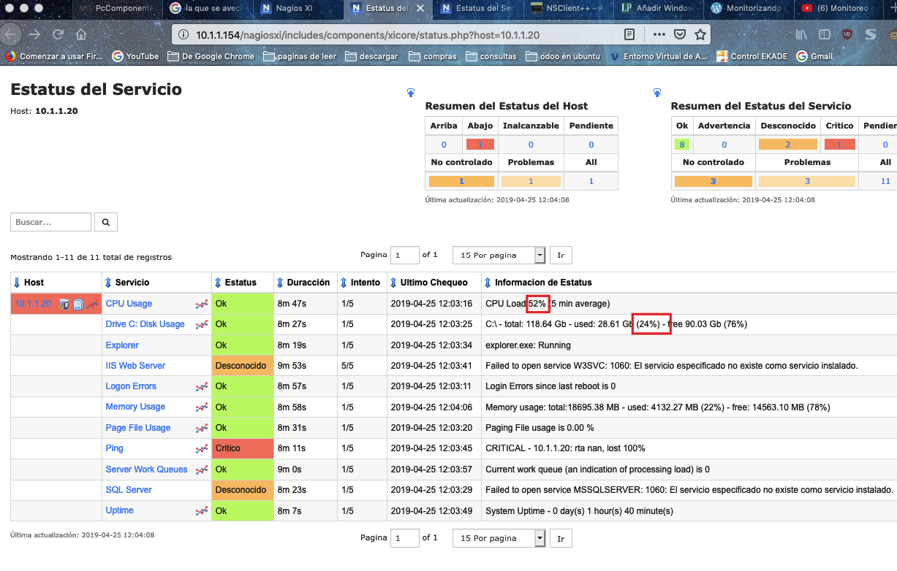

Y aqui unos minutos mas tarde vemos como el consumo de la CPU - RAM - Disco duro suben de rendimiento
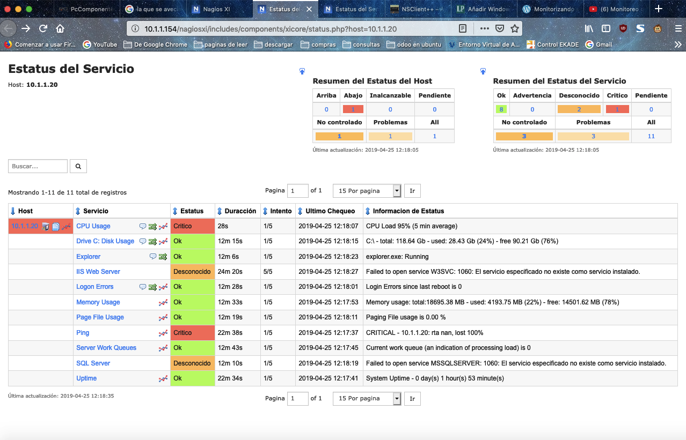
