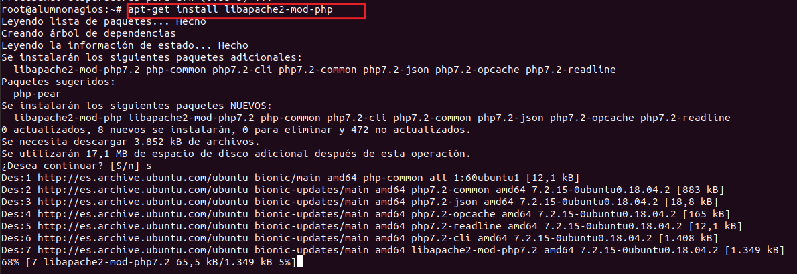
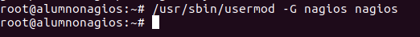
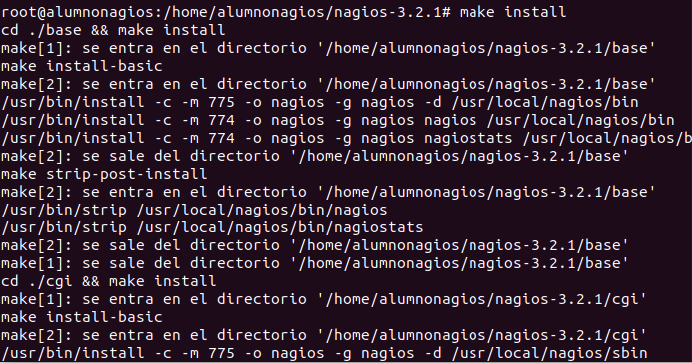
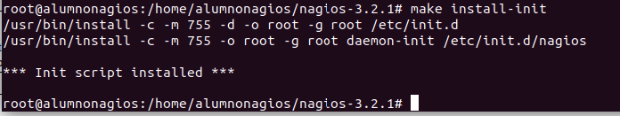
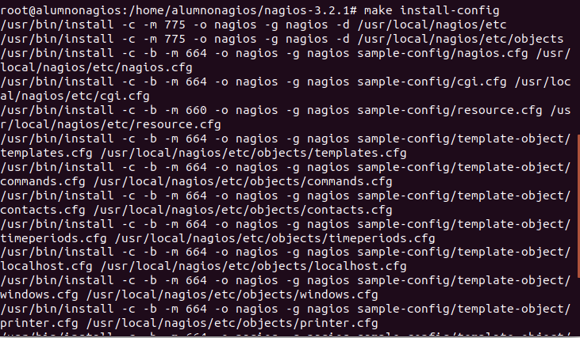
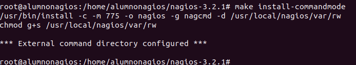

# Proyecto IDP NAGIOS #
=======================
## INSTALACIÓN NAGIOS ##

###PASO 1 Prerrequisitos###
Nuestro proyecto esta echo en linux,para la utilización del software de monitorización nagios en este sistema operativo necesitaremos lo siguiente

	- Apache
	- PHP
	- GCC:librerias de desarrollo y compilación>
	- GD:librerías de desarrollo

  

  

  

Instalamos **GD** (version 7.10) Mediante el comando **sudo apt-get install libgd2-xpm-dev**

###PASO 2 Crear informacion de cuenta de usuario###

A partir de aqui todo lo tenemos que hacer como root, lo primero que haremos sera lo siguiente:

Antes de la version 6.01 debemos crear un grupo llamado nagios, pero como nosotros utilizamos la versión 7.10 ya ubuntu nos crea el grupo directamente.

###PASO 3 Compilación e instalación de Nagios en Ubuntu###

###PASO 4 Personalización de la configuración###

