# Proyecto IDP NAGIOS #

## INSTALACIÓN NAGIOS ##

### PASO 1 Prerrequisitos ###
Nuestro proyecto esta echo en linux,para la utilización del software de monitorización nagios en este sistema operativo necesitaremos lo siguiente:

	- Apache
	- PHP
	- GCC:librerias de desarrollo y compilación>
	- GD:librerías de desarrollo

Por tanto comenzamos con la instalación de **APACHE** mediante el comando apt-get install 

  
Instalamos **PHP** mediante el comando apt-get install

Instalamos **GCC** mediante el comando apt-get install 

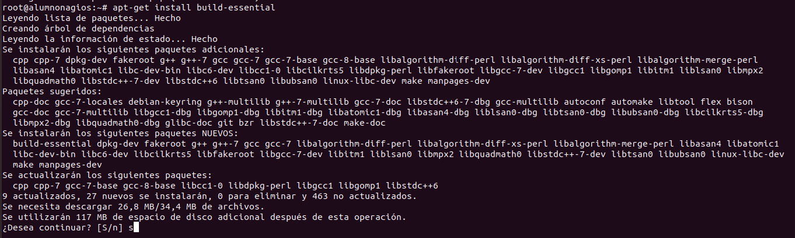

Instalamos **GD** (version 7.10) Mediante el comando **sudo apt-get install libgd2-xpm-dev**

### PASO 2 Crear informacion de cuenta de usuario ###

A partir de aqui todo lo tenemos que hacer como root, lo primero que haremos sera lo siguiente:

Creamos una nueva cuenta de usuario llamada "nagios".

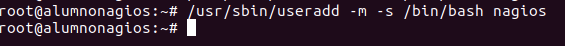

Le asignamos contraseña a dicho usuario.

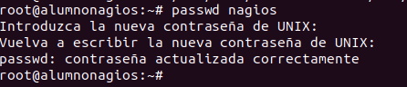

Antes de la version 6.01 debemos crear un grupo llamado **nagios**, pero como nosotros utilizamos la versión 7.10 ya ubuntu nos crea el grupo directamente.

Como ya tenemos el grupo creado procedemos a meter directamente el usuario que creamos antes en el grupo nagios.

Creamos el grupo **nagcmd** ya que tambien nos hara falta y meteremos al usuario nagios dentro de este.

Metemos al usuario de apache **www-data** en el grupo nagcmd, esto lo hacemos por que la aplicación necesita estar dentro de este grupo para hacer sus gestiones

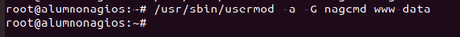

### PASO 3 Compilación e instalación de Nagios en Ubuntu ###

Procedemos a descargarnos los paquetes nagios, en nuestro caso los almacenaremos en **/home/alumnonagios**

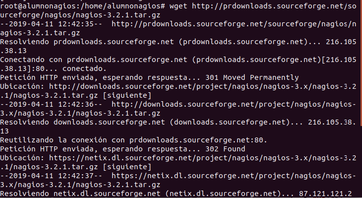

Los paquetes que hemos descargados estan comprimidos, por tanto procedemos a descomprimirlos

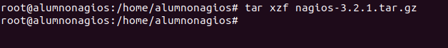

Ejecutamos el scrip de configuración de Nagios indicandole el nombre del grupo que creamos anteriormente.

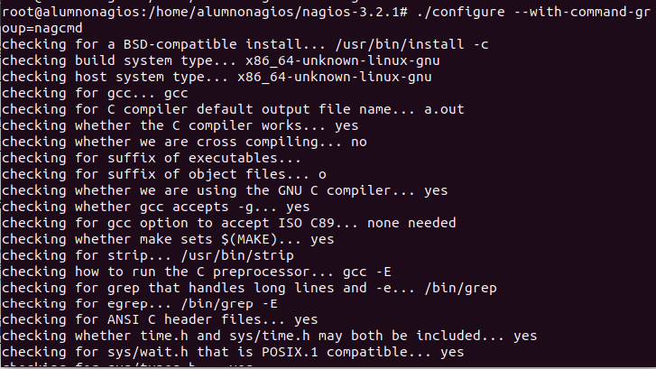

Compilamos el código fuente de Nagios.

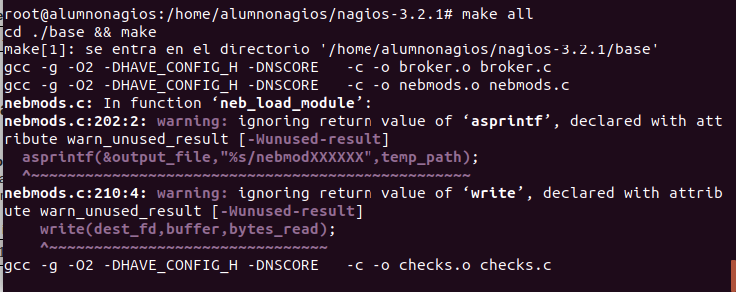

Instalamos los archivos binarios de Nagios.

A continuación instalamos otros scripts y configuraciones que nos servirán mas tarde(instalamos script de inicio).

Instalamos ejemplos de ficheros de configuración.

Damos permisos al directorio de comandos externos.

### PASO 4 Personalización de la configuración ###

Una vez instalado Nagios en nuestro sistema Ubuntu lo que nos queda por hacer es la configuración, en primer lugar modificaremos la dirección de e-mail que usaremos para las notificaciones de Nagios, para esto abriremos el siguiente fichero mediante un editor de texto **/usr/local/nagios/etc/objects/contacts.cfg**

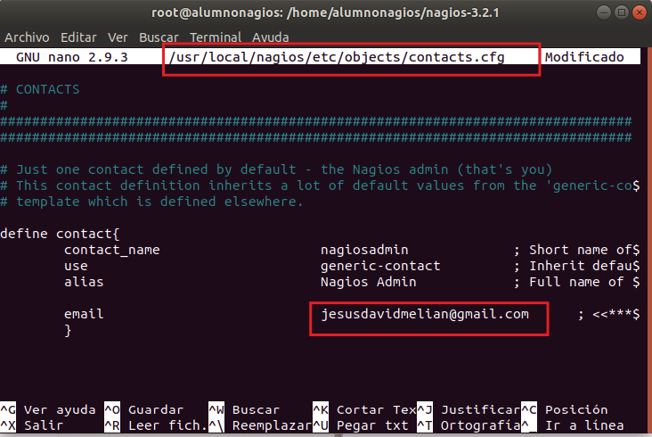

Ahora utilizaremos un comando que en primer lugar chequeara todos los componentes de nuestro nagios, una vez echo procedera a configurarlos uno a uno.

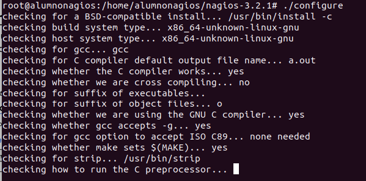

### PASO 5 Configuración de la Interfaz Web ###

Instalamos el archivo de configuración de Nagios para Apache, con esto podemos ver y administrar Nagios via web, esto lo haremos con el comando **make install-webconf**

Creamos un usuario llamado nagiosadmin, dicho usuario podra acceder vía web a Nagios.

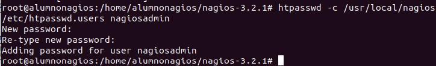

Reiniciamos Apache para que los cambios surtan efecto.

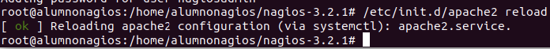

### PASO 6 Compilar e Instalar los plugins de Nagios ###

A continuacion procedemos a descargar los plugins que instalaremos en nuestro nagios, la descarga se hara comprimida asi que posteriormente tendremos que descomprimir el archivo

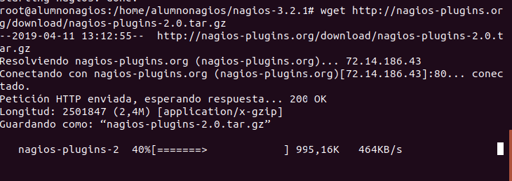

### Paso 7 Inicio de Nagios en Ubuntu ###

Ahora vamos a configurar Nagios para que se inicie automáticamente junto con Ubuntu. Para ello usamos el script que hemos generado antes con **"make install-init"**

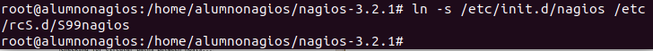

Verificamos que las configuraciones e instalación de Nagios en Ubuntu están bien, si hubieramos configurado algo mal durante la instalación sería en este punto donde aparecerían los errores.

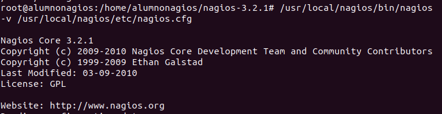

A continuación se nos muestra el informe que nos genera el comando anterior los fallos que hemos tenido durante la instalación.

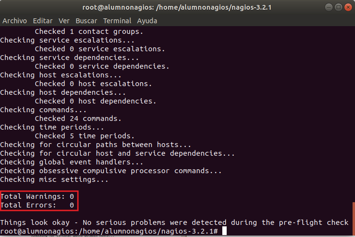

Al no tener errores procedemos a iniciar el nagios.
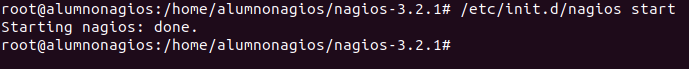

